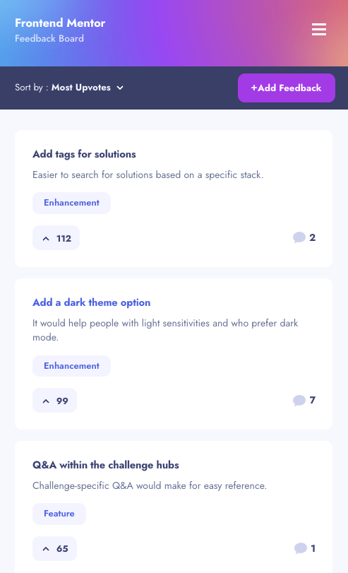

# Frontend Mentor - Product feedback app solution

This is a solution to the [Product feedback app challenge on Frontend Mentor](https://www.frontendmentor.io/challenges/product-feedback-app-wbvUYqjR6). Frontend Mentor challenges help you improve your coding skills by building realistic projects.

## Table of contents

- [Overview](#overview)
  - [The challenge](#the-challenge)
  - [Screenshot](#screenshot)
  - [Links](#links)
- [My process](#my-process)
  - [Built with](#built-with)
  - [Useful resources](#useful-resources)
- [Author](#author)

## Overview

### The challenge

Users should be able to:

- View the optimal layout for the app depending on their device's screen size
- See hover states for all interactive elements on the page
- Create, read, update, and delete product feedback requests
- Receive form validations when trying to create/edit feedback requests
- Sort suggestions by most/least upvotes and most/least comments
- Filter suggestions by category
- Add comments and replies to a product feedback request
- Upvote product feedback requests
- **Bonus**: Keep track of any changes, even after refreshing the browser (`localStorage` could be used for this if you're not building out a full-stack app)

### Screenshot

### Links

- Solution URL: [Github repo](https://github.com/mrcordova/product-feedback-app)
- Live Site URL: [Live Site](https://product-feedback-app-ikpg.onrender.com/index.html)

## My process

### Built with

- Semantic HTML5 markup
- CSS custom properties
- Flexbox
- CSS Grid
- Mobile-first workflow

### Useful resources

- [How to sort element nodes](https://stackoverflow.com/questions/282670/easiest-way-to-sort-dom-nodes) - I learned to sort element nodes.
- [How to loop through an array based on object property](https://stackoverflow.com/questions/16626735/how-to-loop-through-an-array-containing-objects-and-access-their-properties) - This is an amazing article which helped me finally understand XYZ. I'd recommend it to anyone still learning this concept.
- [How to reload page when go backwards](https://stackoverflow.com/questions/43043113/how-to-force-reloading-a-page-when-using-browser-back-button) - I based my idea of a history stack on this link.

## Author

- Website - [Noah](https://noahs.software)
- Frontend Mentor - [@mrcordova](https://www.frontendmentor.io/profile/mrcordova)
